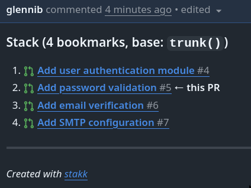

# stakk

**stakk** bridges [Jujutsu](https://github.com/jj-vcs/jj) bookmarks to GitHub
stacked pull requests.

It is not a jj wrapper. It complements jj by reading your local bookmark state
and turning it into a coherent set of GitHub PRs that merge into each other in
the correct order — with stack-awareness comments, correct base branches, and
idempotent updates.

## Features

- **Automatic stack detection** — analyzes the jj change graph to find bookmark
  chains and their topological order.
- **Stacked PR submission** — creates or updates GitHub PRs with correct base
  branches so each PR shows only its own diff.
- **Stack-awareness comments** — adds a comment to every PR listing the full
  stack with links, updated in place on re-runs.
- **Idempotent** — re-running `stakk submit` is always safe. Existing PRs are
  updated, never duplicated.
- **Dry-run mode** — `--dry-run` shows exactly what would happen without
  touching GitHub.
- **Interactive selection** — running `stakk submit` without a bookmark
  argument shows an interactive two-stage prompt: pick a stack, then pick
  how far up the stack to submit. Shared ancestors are annotated, and each
  option shows the resulting PR count.
- **Draft PRs** — `--draft` creates new PRs as drafts.
- **PR body from descriptions** — PR titles and bodies are populated from jj
  change descriptions. Manually edited PR bodies are never overwritten.
- **No direct git usage** — all VCS operations go through `jj` commands, so
  workspaces and non-colocated repos work automatically.
- **Forge-agnostic core** — GitHub is the first implementation, but the
  submission logic is decoupled behind a `Forge` trait.


## Origins

stakk is inspired by [jj-stack](https://github.com/keanemind/jj-stack), a
TypeScript/ReScript CLI that does the same job. jj-stack's core algorithms —
change graph construction, segment grouping, topological ordering — directly
informed stakk's design.

stakk reimplements these ideas in Rust to continue the development of these
ideas, as well as to address new features and desired changes.

## Installation

### mise (recommended)

```
mise use -g 'github:glennib/stakk'
```

Or from crates.io:

```
mise use -g 'cargo:stakk'
```

### cargo-binstall

```
cargo binstall stakk
```

### cargo install

```
cargo install stakk
```

### Pre-built binaries

Download from the [latest release](https://github.com/glennib/stakk/releases/latest).

## Quick start

```
# Submit interactively — pick a stack and bookmark from a menu
stakk

# Submit a specific bookmark (and its ancestors) as stacked PRs
stakk submit my-feature

# Preview what would happen without doing anything
stakk submit my-feature --dry-run

# Create PRs as drafts
stakk submit my-feature --draft

# See your bookmark stacks without submitting
stakk show
```

## How stacking works

In jj, you create bookmarks that point at changes. When bookmarks form a
linear chain — each building on the previous — they represent a stack:

```
trunk
  └── feat-auth        ← bookmark 1
        └── feat-api   ← bookmark 2
              └── feat-ui  ← bookmark 3
```

When you run `stakk submit feat-ui`, stakk:

1. **Analyzes** the change graph to find the stack containing `feat-ui` and
   all its ancestors (`feat-auth`, `feat-api`, `feat-ui`).
2. **Plans** the submission by checking GitHub for existing PRs, determining
   which bookmarks need pushing, which PRs need creating, and which base
   branches need updating.
3. **Executes** the plan: pushes bookmarks, creates or updates PRs with
   correct base branches, and adds stack-awareness comments to every PR.

The result on GitHub:

- `feat-auth` → PR targeting `main`
- `feat-api` → PR targeting `feat-auth`
- `feat-ui` → PR targeting `feat-api`

Each PR shows only its own diff, and a stack comment on every PR links all related
PRs together:



Re-running `stakk submit` is always safe — it updates existing PRs rather
than creating duplicates.

## Usage

### `stakk` (no arguments)

Launches the interactive submission flow with a two-stage prompt: pick a stack,
then choose how far up the stack to submit. This is equivalent to `stakk submit`
without arguments.

### `stakk submit [bookmark]`

Submit a bookmark and all its ancestors as stacked PRs. When run without a
bookmark argument, an interactive two-stage prompt lets you pick a stack and
then choose how far up the stack to submit:

```
? Which stack?
> ○ ← base ← feat-b ← feat-c  (3 PRs)
  ○ ← standalone  (1 PR: fix login bug)

? Submit up to which bookmark?
> feat-c (leaf, 1 commit) → 3 PRs
      add caching layer
  feat-b (2 commits) → 2 PRs
      refactor auth module
  base (base, 1 commit) → 1 PR
      add user model
```

Stages are skipped automatically when there's only one option (e.g., a
single stack skips stage 1, a single bookmark auto-selects immediately).

| Flag | Description |
|------|-------------|
| `--dry-run` | Show the submission plan without executing |
| `--draft` | Create new PRs as drafts |
| `--remote <name>` | Push to a specific remote (default: `origin`) |

PR titles come from the first line of the jj change description. PR bodies
are populated from the full description (everything after the title line).
For segments with multiple commits, descriptions are joined with `---`
separators. Bodies are only set on PR creation — manually edited PR bodies
are never overwritten.

### `stakk show`

Display repository status and all bookmark stacks without submitting.

Shows the default branch, remotes, and all bookmark stacks with their commit
summaries and PR counts:

```
Default branch: main
Remote: origin git@github.com:you/repo.git (you/repo)

Stacks (3 found):
  Stack 1:
    feature-auth (1 commit(s)): feat: add authentication
    feature-api (2 commit(s)): feat: add API endpoints
  Stack 2:
    feature-ui (1 commit(s)): feat: add UI layer
  Stack 3:
    feature-tests (1 commit(s)): test: add integration tests
```

### `stakk completions <shell>`

Generate shell completions. Supported shells: `bash`, `zsh`, `fish`, `elvish`,
`powershell`.

```
# Zsh — add to your fpath
stakk completions zsh > ~/.zfunc/_stakk

# Bash
stakk completions bash > ~/.local/share/bash-completion/completions/stakk

# Fish
stakk completions fish > ~/.config/fish/completions/stakk.fish
```

### `stakk auth test`

Validate that GitHub authentication is working and print the authenticated
username.

### `stakk auth setup`

Print instructions for setting up authentication. stakk resolves a GitHub
token in this order:

1. **GitHub CLI** (`gh auth token`) — recommended
2. **`GITHUB_TOKEN`** environment variable
3. **`GH_TOKEN`** environment variable

## Design

stakk never calls `git` directly. All git operations go through `jj`
subcommands (`jj git push`, `jj git remote list`, etc.). This means stakk
works automatically in jj workspaces and non-colocated repositories — two
cases where calling `git` directly fails.

All forge interaction goes through a `Forge` trait. GitHub is the first (and
currently only) implementation, but the core submission logic is
forge-agnostic. This opens the door to Forgejo, GitLab, or other platforms
in the future.

The submission pipeline is split into three phases:

- **Analyze** — pure function, no I/O, fully testable with mock data
- **Plan** — queries the forge for existing PRs, determines actions
- **Execute** — pushes bookmarks, creates/updates PRs, manages comments

This separation makes the business logic testable without hitting real APIs,
and `--dry-run` falls out naturally (run phases 1 and 2, skip 3).

## License

MIT
