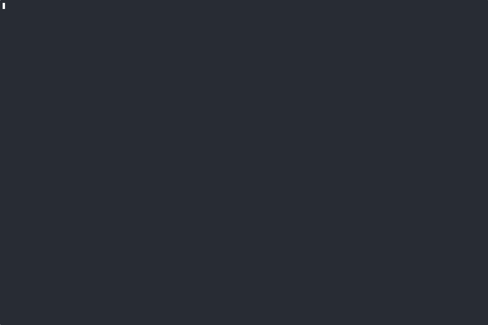
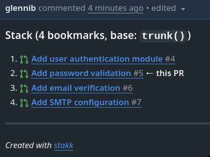

# stakk

**stakk** bridges [Jujutsu](https://github.com/jj-vcs/jj) bookmarks to GitHub
stacked pull requests.

It is not a jj wrapper. It complements jj by reading your local bookmark state
and turning it into a coherent set of GitHub PRs that merge into each other in
the correct order — with stack-awareness comments, correct base branches, and
idempotent updates.



## Features

- **Automatic stack detection** — analyzes the jj change graph to find bookmark
  chains and their topological order.
- **No bookmarks required** — stakk discovers unbookmarked heads and lets you
  create bookmarks on-the-fly via the interactive TUI. Auto-generated
  `stakk-<change_id>` names keep things simple.
- **Auto bookmark naming** — the `[~]auto` toggle in the TUI generates
  descriptive bookmark names from commit descriptions and file paths using
  TF-IDF (term frequency–inverse document frequency) scoring. Press `r` to
  cycle through alternative names. An optional `--auto-prefix` lets you brand
  the names (e.g. `gb-caching-database`).
- **Stacked PR submission** — creates or updates GitHub PRs with correct base
  branches so each PR shows only its own diff.
- **Stack-awareness comments** — adds a comment to every PR listing the full
  stack with links, updated in place on re-runs. Optionally, the stack info
  can be placed in the PR body instead (`--stack-placement body`). Comments
  are rendered with [minijinja](https://github.com/mitsuhiko/minijinja)
  templates and can be customized with `--template` or the `STAKK_TEMPLATE`
  environment variable.
- **Idempotent** — re-running `stakk submit` is always safe. Existing PRs are
  updated, never duplicated.
- **Dry-run mode** — `--dry-run` shows exactly what would happen without
  touching GitHub.
- **Interactive TUI** — running `stakk` without arguments launches a ratatui
  TUI: a graph view shows all branch stacks, then a bookmark assignment screen
  lets you toggle bookmarks on unmarked commits before submitting. Each commit
  cycles through: `[x]` existing → `[~]` auto → `[+]` generated `stakk-xxxx`
  → `[*]` custom command → `[ ]` skip.
- **Draft PRs** — `--draft` creates new PRs as drafts.
- **PR body from descriptions** — PR titles and bodies are populated from jj
  change descriptions. Manually edited PR bodies are never overwritten.
- **No direct git usage** — all VCS operations go through `jj` commands, so
  workspaces and non-colocated repos work automatically.
- **Forge-agnostic core** — GitHub is the first implementation, but the
  submission logic is decoupled behind a `Forge` trait.

## Origins

stakk is inspired by [jj-stack](https://github.com/keanemind/jj-stack), a
TypeScript/ReScript CLI that does the same job. jj-stack's core algorithms —
change graph construction, segment grouping, topological ordering — directly
informed stakk's design.

stakk reimplements these ideas in Rust to continue the development and to
address new features and desired changes.

## Installation

### mise (recommended)

```
mise use -g 'github:glennib/stakk'
```

Or from crates.io:

```
mise use -g 'cargo:stakk'
```

### cargo-binstall

```
cargo binstall stakk
```

### cargo install

```
cargo install stakk
```

### Pre-built binaries

Download from the [latest release](https://github.com/glennib/stakk/releases/latest).

## Quick start

```
# Submit interactively — pick a stack and assign bookmarks via TUI
stakk

# Works even without any bookmarks — the TUI lets you create them
stakk

# Submit a specific bookmark (and its ancestors) as stacked PRs
stakk submit my-feature

# Preview what would happen without doing anything
stakk submit my-feature --dry-run

# Create PRs as drafts
stakk submit my-feature --draft

# See your bookmark stacks without submitting
stakk show
```

## How stacking works

In jj, bookmarks point at changes. When bookmarks form a linear chain — each
building on the previous — they represent a stack. You can create bookmarks
yourself, or let stakk discover unbookmarked heads and create them interactively:

```
trunk
  └── feat-auth        ← bookmark 1
        └── feat-api   ← bookmark 2
              └── feat-ui  ← bookmark 3
```

When you run `stakk submit feat-ui`, stakk:

1. **Analyzes** the change graph to find the stack containing `feat-ui` and
   all its ancestors (`feat-auth`, `feat-api`, `feat-ui`).
2. **Plans** the submission by checking GitHub for existing PRs, determining
   which bookmarks need pushing, which PRs need creating, and which base
   branches need updating.
3. **Executes** the plan: pushes bookmarks, creates or updates PRs with
   correct base branches, and adds stack-awareness comments to every PR.

The result on GitHub:

- `feat-auth` → PR targeting `main`
- `feat-api` → PR targeting `feat-auth`
- `feat-ui` → PR targeting `feat-api`

Each PR shows only its own diff, and a stack comment on every PR links all related
PRs together:



Re-running `stakk submit` is always safe — it updates existing PRs rather
than creating duplicates.

## Configuration

stakk loads settings from TOML config files, environment variables, and CLI
flags. The full precedence order (highest to lowest):

1. **CLI flags** — `--remote`, `--draft`, `--pr-mode`, etc.
2. **Environment variables** — `STAKK_REMOTE`, `STAKK_DRAFT`, etc.
3. **Repository config** — `stakk.toml` found by walking up from the current
   directory
4. **User config** — `~/.config/stakk/config.toml` (Linux),
   `~/Library/Application Support/stakk/config.toml` (macOS),
   `%APPDATA%\stakk\config\config.toml` (Windows)
5. **Built-in defaults**

### Config files

stakk discovers config files automatically — no flags needed.

**Repository config** is found by walking from the current directory toward the
jj workspace root (the directory containing `.jj/`), stopping at the first
`stakk.toml` found. The search does not continue past the repo root. To share
config across multiple repos, use `--config` or the `STAKK_CONFIG` environment
variable.

**User config** is loaded from your platform's standard config directory. On
Linux this is typically `~/.config/stakk/config.toml`.

Both files use the same format. When both exist, settings from the repo config
take precedence — the user config fills in any fields the repo config leaves
unset.

### Config file format

All fields are optional. Absent fields fall back to the next level in the
precedence chain.

```toml
# stakk.toml — example with all available fields

# Git remote to push to (default: "origin")
remote = "origin"

# PR creation mode: "regular" or "draft" (default: "regular")
pr_mode = "draft"

# Path to a custom minijinja template for stack comments
template = "/path/to/my-template.md.jinja"

# Where to place stack info: "comment" or "body" (default: "comment")
stack_placement = "body"

# Prefix for auto-generated bookmark names (default: none)
auto_prefix = "gb-"

# Revset for discovering bookmarks (default: "mine() ~ trunk() ~ immutable()")
bookmarks_revset = "mine() ~ trunk() ~ immutable()"

# Revset for discovering unbookmarked heads
# (default: "heads((mine() ~ empty() ~ immutable()) & trunk()..)")
heads_revset = "heads((mine() ~ empty() ~ immutable()) & trunk()..)"

# Shell command for generating custom bookmark names
bookmark_command = "my-bookmark-namer"

# Whether to merge with the user config (default: true)
# Set to false in a repo config to ignore the user config entirely.
inherit = true
```

Unknown fields cause a parse error, so typos are caught early.

### The `inherit` field

By default, repo config and user config are merged: the repo config wins for
any field it sets, and the user config fills in the rest. If a repo needs to
ignore the user config entirely (e.g. to enforce team-wide settings), set
`inherit = false` in the repo-level `stakk.toml`:

```toml
# stakk.toml — standalone, ignores user config
inherit = false
pr_mode = "regular"
stack_placement = "comment"
```

`inherit` only has meaning in a repo config. It is not merged from the user
config.

### Examples

**User config** — personal defaults across all repos:

```toml
# ~/.config/stakk/config.toml
pr_mode = "draft"
stack_placement = "body"
```

**Repo config** — override remote for this repo, inherit everything else:

```toml
# stakk.toml (in repo root)
remote = "upstream"
```

With both files above, running `stakk submit my-feature` uses
`remote = "upstream"` from the repo config and `pr_mode = "draft"`,
`stack_placement = "body"` from the user config. Passing `--pr-mode regular` on
the command line overrides all of them.

**Team-enforced config** — no user config inheritance:

```toml
# stakk.toml (in repo root)
inherit = false
remote = "origin"
pr_mode = "regular"
stack_placement = "comment"
```

## Environment variables

| Variable | Description |
|----------|-------------|
| `STAKK_CONFIG` | Path to config file, overrides automatic discovery (overridden by `--config`) |
| `STAKK_REMOTE` | Default git remote to push to (overridden by `--remote`) |
| `STAKK_PR_MODE` | PR creation mode: `regular` or `draft` (overridden by `--pr-mode`) |
| `STAKK_DRAFT` | Set to `true` to always create draft PRs (overridden by `--draft`) |
| `STAKK_TEMPLATE` | Path to a custom minijinja template for stack comments (overridden by `--template`) |
| `STAKK_STACK_PLACEMENT` | Where to place the stack info: `comment` (default) or `body` (overridden by `--stack-placement`) |
| `STAKK_AUTO_PREFIX` | Prefix for auto-generated bookmark names (overridden by `--auto-prefix`) |
| `STAKK_BOOKMARK_COMMAND` | Shell command for generating custom bookmark names (overridden by `--bookmark-command`) |
| `GITHUB_TOKEN` | GitHub personal access token (see `stakk auth setup`) |
| `GH_TOKEN` | Alternative to `GITHUB_TOKEN` |

CLI flags take precedence over environment variables, which take precedence over
config files. See [Configuration](#configuration) for the full precedence order.

## Usage

### `stakk` (no arguments)

Launches the interactive submission flow. A ratatui TUI shows a graph of all
branch stacks; select a leaf branch, then toggle bookmarks on commits that need
them. Works even in repos with no pre-existing bookmarks — stakk creates
`stakk-<change_id>` bookmarks for unmarked commits. Equivalent to
`stakk submit` without arguments.

### `stakk submit [bookmark]`

Submit a bookmark and all its ancestors as stacked PRs. When run without a
bookmark argument, an interactive ratatui TUI lets you select a branch from a
graph view, then assign bookmarks to any unmarked commits before submitting.

| Flag | Env var | Description |
|------|--------|-------------|
| `--dry-run` | | Show the submission plan without executing |
| `--draft` | `STAKK_DRAFT` | Create new PRs as drafts |
| `--remote <name>` | `STAKK_REMOTE` | Push to a specific remote (default: `origin`) |
| `--template <path>` | `STAKK_TEMPLATE` | Use a custom minijinja template for stack comments |
| `--stack-placement <mode>` | `STAKK_STACK_PLACEMENT` | Place stack info as a PR `comment` (default) or in the PR `body` |
| `--auto-prefix <prefix>` | `STAKK_AUTO_PREFIX` | Prefix for `[~]auto` bookmark names (e.g. `gb-`) |

PR titles come from the first line of the jj change description. PR bodies
are populated from the full description (everything after the title line).
For segments with multiple commits, descriptions are joined with `---`
separators. Bodies are only set on PR creation — manually edited PR bodies
are never overwritten.

### `stakk show`

Display repository status and all bookmark stacks without submitting.

Shows the default branch, remotes, and all bookmark stacks with their commit
summaries and PR counts:

```
Default branch: main
Remote: origin git@github.com:you/repo.git (you/repo)

Stacks (3 found):
  Stack 1:
    feature-auth (1 commit(s)): feat: add authentication
    feature-api (2 commit(s)): feat: add API endpoints
  Stack 2:
    feature-ui (1 commit(s)): feat: add UI layer
  Stack 3:
    feature-tests (1 commit(s)): test: add integration tests
```

### `stakk completions <shell>`

Generate shell completions. Supported shells: `bash`, `zsh`, `fish`, `elvish`,
`powershell`.

```
# Zsh — add to your fpath
stakk completions zsh > ~/.zfunc/_stakk

# Bash
stakk completions bash > ~/.local/share/bash-completion/completions/stakk

# Fish
stakk completions fish > ~/.config/fish/completions/stakk.fish
```

### `stakk auth test`

Validate that GitHub authentication is working and print the authenticated
username.

### `stakk auth setup`

Print instructions for setting up authentication. stakk resolves a GitHub
token in this order:

1. **GitHub CLI** (`gh auth token`) — recommended
2. **`GITHUB_TOKEN`** environment variable
3. **`GH_TOKEN`** environment variable

## Design

stakk never calls `git` directly. All git operations go through `jj`
subcommands (`jj git push`, `jj git remote list`, etc.). This means stakk
works automatically in jj workspaces and non-colocated repositories — two
cases where calling `git` directly fails.

All forge interaction goes through a `Forge` trait. GitHub is the first (and
currently only) implementation, but the core submission logic is
forge-agnostic. This opens the door to Forgejo, GitLab, or other platforms
in the future.

The submission pipeline is split into three phases:

- **Analyze** — pure function, no I/O, fully testable with mock data
- **Plan** — queries the forge for existing PRs, determines actions
- **Execute** — pushes bookmarks, creates/updates PRs, manages comments

This separation makes the business logic testable without hitting real APIs,
and `--dry-run` falls out naturally (run phases 1 and 2, skip 3).

## License

MIT OR Apache-2.0
